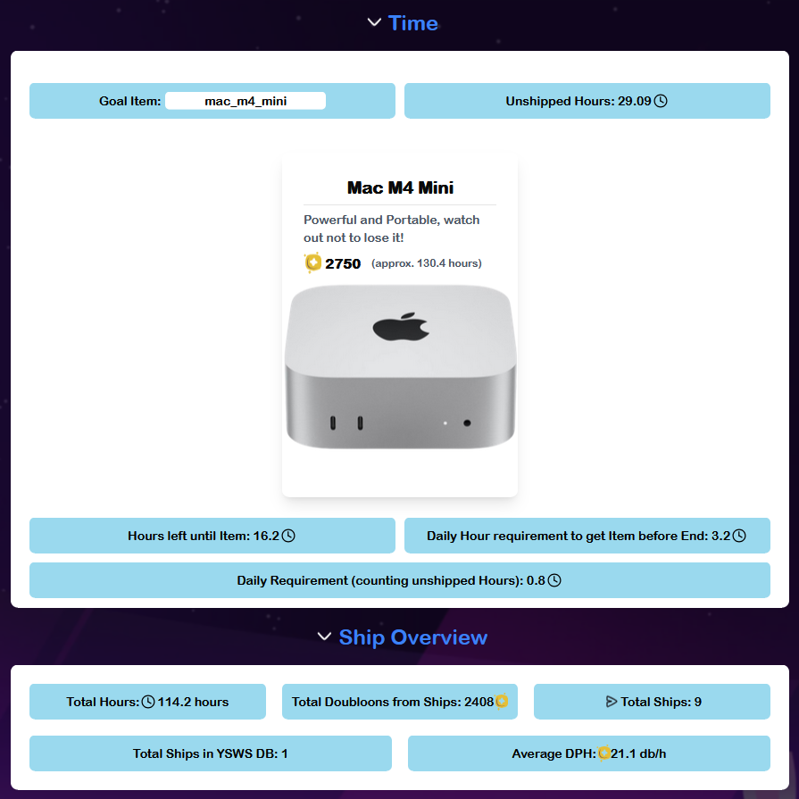

# YAHSE (Yet Another High Seas Extension)

## About

My first attempt at a browser extension! Inspired by https://ext.hackclub.benjs.uk/, I wanted to make something similar that also shows some more stats, like Daily Hours needed until goal and unshipped Hours, since High Seas is ending soon and I wasn't sure how much exactly I had to work for some items!

## Made With..

- Javascript & CSS
- Hackatime API!

## Features

### Ships

- View Vote count (out of 10)
- View Doubloons per Hour (Also appears when you click the ship!)

### Basic Overview
- Total Hours
- Doubloons gained from ships
- Ship count
- Ships in YSWS Database
- Average DPH

### Time Overview

- View Unshipped Hours (Using the Hackatime API!)
-  Set A Goal Item 
- - View How many Hours are left until you can afford the Item (calculated with your average DPH)
- - View Daily Hour Requirement to get item
- - View Daily Hour Requirement If you ship all your unshipped Hours

## Installation

First, Download the .zip File From the github repo!

### Chrome

1. Go to chrome://extensions/ or navigate to Extensions in the top right
2. Enable Developer Mode in the top right
3. Unzip the .zip file you downloaded!
4. A Bar with some options should appear, click "Load unpacked" (usually first option)
5. Navigate to the unzipped folder and select the "src" Folder
6. Done! Now you can go to https://highseas.hackclub.com and use the Extension!

### Firefox

1. Go to about:debugging in the search bar and select "This Firefox" in the sidebar.
2. Under "Temporary Extensions", select "Load Temporary Add-on"
3. Then, just select the .zip Folder, or, if you already unzipped the zip, the manifest.json file
4.  Done!

## Usage

- When first loading in, you will get a Popup asking you for your Hackatime API key. Just go to https://waka.hackclub.com, click on your profile picture in the top right, and click "Copy API Key". Then, return to highseas and paste it into the Input Field!

- To Load the Time overview, you might have to load the shop Items by going into the shop tab once. The Extension should tell you to do that already though.